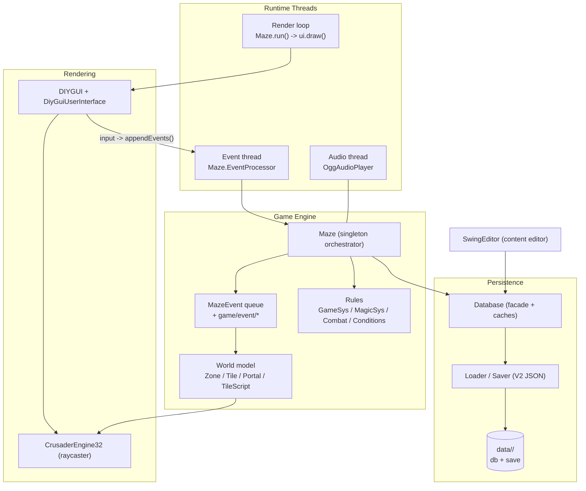
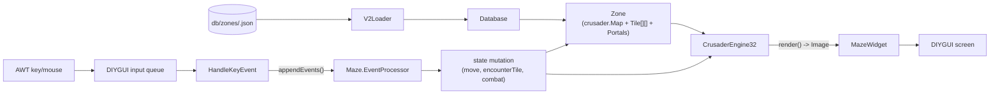

# Escape From The Maze - Architecture & High-Level Design Spec

> Status: living document. Reflects the source tree under `src/maze/mclachlan/`.
> Companion reference: [data_dictionary.md](data_dictionary.md).

## 1. Overview

Escape From The Maze is a party-based, first-person, phased-combat fantasy CRPG in
the Wizardry lineage. It is a single desktop application (plus a separate content
editor) written entirely in Java.

| Aspect | Detail |
|--------|--------|
| Language / platform | Java 21, AWT/Swing, no game framework |
| Build | Apache Ant ([build.xml](../../build.xml)) |
| Runtime dependencies | Vendored jars in `oem/`: `gson-2.8.6` (JSON), `jorbis` + `java-vorbis-support` (Ogg audio) |
| Code namespace | `mclachlan.*`, rooted at `src/maze/` |
| Game entry point | `mclachlan.maze.game.Launcher` -> `mclachlan.maze.game.Maze` |
| Editor entry point | `mclachlan.maze.editor.swing.SwingEditor` |
| Content/data | `data/<campaign>/` (campaign DB + save games + assets) |
| Scale | ~1,060 Java files, ~200K LOC |

The runtime is built from five major components:

| Component | Package(s) | Responsibility |
|-----------|------------|----------------|
| Game engine | `maze/game`, `maze/map`, `maze/stat` | Orchestration, event/turn loop, world model, rules |
| Raycaster (Crusader) | `crusader` | 3D first-person rendering of a zone map |
| UI framework (DIYGUI) | `diygui`, `maze/ui/diygui` | Custom widget toolkit + game screens |
| Persistence | `maze/data` (`v1`, `v2`) | Load/save campaign data and save games |
| Editor | `maze/editor/swing` | Swing desktop tool to author all game content |

Supporting libraries: `dungeongen` (procedural dungeon generation), `jgpgoap` +
`maze/game/goapai` (GOAP planner, currently experimental), `maze/audio`,
`maze/util`.

## 2. Top-Level Architecture

The application runs on three cooperating threads, coordinated by the `Maze`
singleton. UI input is captured on the AWT thread and handed to a dedicated event
thread; **all game-state mutation happens on that single event thread** via
`MazeEvent`s, while a continuous render loop draws the current state.

## 3. Components

### 3.1 Game Engine

Files: `src/maze/mclachlan/maze/game/`, `src/maze/mclachlan/maze/map/`,
`src/maze/mclachlan/maze/stat/`.

The engine is a singleton orchestrator with an event-sourcing core.

**Orchestration & lifecycle.**
[`Maze`](../../src/maze/mclachlan/maze/game/Maze.java) is the central engine class
(note: it has no `main()`; the JVM entry point is
[`Launcher`](../../src/maze/mclachlan/maze/game/Launcher.java)). `Maze.init()`
boots the database, the pluggable UI, the worker threads, the rules systems
(`GameSys`, `MagicSys` - chosen reflectively from `maze.cfg`), then shows the main
menu. `Maze.run()` is a continuous redraw loop (`while state != FINISHED: ui.draw()`),
not a fixed-tick loop - turns only advance when game events call `incTurn()`.

**State machine.** `Maze.State` (e.g. `MAINMENU`, `MOVEMENT`, `COMBAT`,
`ENCOUNTER_ACTORS`, `ENCOUNTER_CHEST`, `INVENTORY`, `MAGIC`, `RESTING`, `FINISHED`)
drives the active screen. `setState()` calls `ui.changeState(state)`, which swaps
the visible screen widget.

**Event / turn system.** A unit of work is a
[`MazeEvent`](../../src/maze/mclachlan/maze/game/MazeEvent.java); its `resolve()`
returns child events that are processed depth-first. `Maze.appendEvents(...)`
enqueues events; `EventProcessor` blocks on the queue and resolves them, serialising
all state changes. Reusable, authorable sequences are
[`MazeScript`](../../src/maze/mclachlan/maze/game/MazeScript.java)s (stored in
`scripts.json`). `GameTime.incTurn()` performs end-of-turn housekeeping (conditions,
regen, NPC/zone updates, 300 turns/day) and rolls random encounters on movement.
Representative events live in `game/event/` (`MovePartyEvent`, `ZoneChangeEvent`,
`StartCombatEvent`, `ResolveCombatActionEvent`, `EndCombatRoundEvent`, `SetStateEvent`).

**World model.** A [`Zone`](../../src/maze/mclachlan/maze/map/Zone.java) wraps a
Crusader `Map` (rendering geometry) plus a parallel game-logic layer
([`Tile[][]`](../../src/maze/mclachlan/maze/map/Tile.java),
[`Portal`](../../src/maze/mclachlan/maze/map/Portal.java) list, `ZoneScript`).
Stepping onto a tile runs `Zone.encounterTile(...)`, which executes the tile's
[`TileScript`](../../src/maze/mclachlan/maze/map/TileScript.java)s (e.g. `Encounter`,
`Chest`, `Lever`, `FlavourText`, `ExecuteMazeScript`, `ToggleWall`) and may trigger
NPC encounters. This **dual map model** (render geometry vs game logic) is kept in
sync by `Zone`.

**Rules & combat.** `stat/` holds the rules engine:
[`GameSys`](../../src/maze/mclachlan/maze/stat/GameSys.java) (initiative, stealth,
encumbrance, identification),
[`Combat`](../../src/maze/mclachlan/maze/stat/combat/Combat.java) + `ActorActionResolver`
(turn-based rounds, intentions, initiative ordering), `MagicSys`/`Spell`, and the
`ConditionManager`. [`UnifiedActor`](../../src/maze/mclachlan/maze/stat/UnifiedActor.java)
is the common base for `PlayerCharacter`, `Foe`, and `Npc`.

**AI.** Foe combat AI is selected per difficulty level. The production
implementation is [`BasicFoeAi`](../../src/maze/mclachlan/maze/game/BasicFoeAi.java)
(heuristic). A GOAP-based planner exists
([`jgpgoap`](../../src/maze/mclachlan/jgpgoap/) +
[`GOAPFoeAI`](../../src/maze/mclachlan/maze/game/goapai/GOAPFoeAI.java)) but is an
incomplete stub and not wired in by default.

### 3.2 Raycaster (Crusader)

Files: `src/maze/mclachlan/crusader/` (engine, `client`, `postprocessor`, `script`).

Crusader is a self-contained, Wolfenstein-style **column-based raycaster** with
modern extensions. It knows nothing about the game; it renders a scene graph and
returns an image.

- **Engine.** [`CrusaderEngine`](../../src/maze/mclachlan/crusader/CrusaderEngine.java)
  is the public interface;
  [`CrusaderEngine32`](../../src/maze/mclachlan/crusader/CrusaderEngine32.java) is the
  sole production implementation (32-bit ARGB).
- **Scene input.** A [`Map`](../../src/maze/mclachlan/crusader/Map.java) holds
  `Tile[]`, separate horizontal/vertical `Wall[]` arrays, `EngineObject[]` (billboard
  sprites), a deduplicated `Texture[]` registry, layered `SkyConfig[]`, and per-frame
  `MapScript[]`.
- **Rendering pipeline.** `render()` calls `renderInternal()`: animate textures/objects,
  run scripts, sort sprites back-to-front, then submit one `DrawColumn` task per screen
  column to a fixed thread pool. Each column DDA-traverses the grid (up to
  `maxHitDepth` wall hits through transparent walls), draws sprites + stacked wall
  textures + floor/ceiling, and fills remaining transparent pixels from the sky. An
  optional `PostProcessor` chain runs column-parallel.
- **Output.** An AWT `java.awt.Image` backed by an ARGB `int[]` via `MemoryImageSource`
  (not a `BufferedImage`).
- **Features.** Per-tile lighting (0-64), distance shading/fog, layered skies
  (cylinder image/gradient, high ceiling, cubemap), animated + scrolling textures,
  light-source sprites, post-processing filters (FXAA, greyscale, ghost, ripple,
  fade-to-black), and per-pixel mouse picking via
  [`MouseClickScript`](../../src/maze/mclachlan/crusader/MouseClickScript.java).
- **Test harness.** [`CrusaderClient`](../../src/maze/mclachlan/crusader/client/CrusaderClient.java)
  runs the engine standalone.

### 3.3 UI Framework (DIYGUI)

Files: `src/maze/mclachlan/diygui/` (toolkit), `src/maze/mclachlan/maze/ui/diygui/`
(game UI).

**DIYGUI** is a custom, Swing-inspired widget toolkit drawn directly onto AWT
`Graphics2D`. It is retained-mode (a persistent widget tree) but drawn immediately
every frame.

- **Core.** [`DIYToolkit`](../../src/maze/mclachlan/diygui/toolkit/DIYToolkit.java)
  owns the content pane, overlay, modal-dialog stack, focus/hover, the input queue,
  and the draw entry point. [`Widget`](../../src/maze/mclachlan/diygui/toolkit/Widget.java)
  / `ContainerWidget` form the tree; layout managers include `DIYGridLayout`,
  `DIYBorderLayout`, `DIYFlowLayout`, `NullLayout`.
- **Skinning.** Appearance is fully pluggable via a `RendererFactory` (one `Renderer`
  per widget name). The factory is chosen by config key `mclachlan.maze.ui.renderer`:
  [`MazeRendererFactory`](../../src/maze/mclachlan/maze/ui/diygui/render/maze/MazeRendererFactory.java)
  (procedural Java2D look) vs
  [`MFRendererFactory`](../../src/maze/mclachlan/maze/ui/diygui/render/mf/MFRendererFactory.java)
  (textured "Medieval Fantasy" skin). Both share the same widget classes.
- **Input.** AWT listeners only enqueue events; a dedicated `EventProcessor` thread
  drains the queue and dispatches to widgets via hit-testing (modal-aware), producing
  `ActionEvent`s for `ActionListener`s.
- **Game UI.** [`DiyGuiUserInterface`](../../src/maze/mclachlan/maze/ui/diygui/DiyGuiUserInterface.java)
  implements `UserInterface` and composes screens in a top-level `CardLayoutWidget`
  (main menu, movement, inventory, magic, character screens, etc.). The main movement
  screen is a three-column layout: party panels left/right, the raycaster view +
  message/options area in the center.
- **Raycaster integration.** The 3D view is a widget:
  [`MazeWidget`](../../src/maze/mclachlan/maze/ui/diygui/MazeWidget.java) overrides
  `draw()` to call `engine.render()` and blit the returned `Image`, and forwards mouse
  clicks to the engine's picking (`handleMouseClickAndReturnScript`).

### 3.4 Persistence

Files: `src/maze/mclachlan/maze/data/` (`Database`, `Loader`, `Saver`), `data/v2/`
(JSON serialisers), `data/v1/` (legacy parsers).

A strategy-pattern I/O layer behind a caching facade.

- **Facade.** [`Database`](../../src/maze/mclachlan/maze/data/Database.java) is the
  singleton access point with in-memory typed caches. It supports **campaign
  inheritance** (a campaign overlays its `parentCampaign`).
- **Strategy.** [`Loader`](../../src/maze/mclachlan/maze/data/Loader.java) and
  [`Saver`](../../src/maze/mclachlan/maze/data/Saver.java) define symmetric I/O for
  ~35 data categories plus save-game slices, assets, and strings. The concrete
  implementation is selected reflectively from `maze.cfg`
  (`mclachlan.maze.db.loader.impl` / `...saver.impl`); the production pair is
  [`V2Loader`](../../src/maze/mclachlan/maze/data/v2/V2Loader.java) /
  [`V2Saver`](../../src/maze/mclachlan/maze/data/v2/V2Saver.java).
- **Format.** V2 is JSON (Gson). Each domain type maps to a serialiser built by
  [`V2SerialiserFactory`](../../src/maze/mclachlan/maze/data/v2/serialisers/V2SerialiserFactory.java),
  typically a `ReflectiveSerialiser` with custom field resolvers. Cross-references are
  stored by name (`NameSerialiser`) and resolved against the `Database`; polymorphism
  uses a `TYPE_KEY`/`IMPL` class name. Files are wrapped in a silo
  (`SimpleMapSilo` array / `SingletonSilo` object / `MapSingletonSilo`). V1 is a legacy
  text format; only parsing utilities and a zone-only loader remain, and strings +
  `user.cfg` are still Java Properties.
- **On disk.** `data/<campaign>/db/*.json` (static authored content, plus
  `zones/*.json` and `guild.json`) and `data/<campaign>/save/<slot>/*.json` (runtime
  save state). See the data dictionary for the full file map.
- **Sequencing.** `Maze.init()` eagerly loads the DB caches (zones/images/sounds load
  lazily). `Maze.saveGame()` / `Maze.loadGame()` write/read the save slices in a
  deliberate order (conditions load last, after zone/tile bearers exist).

### 3.5 Editor (Mazemaster)

Files: `src/maze/mclachlan/maze/editor/swing/` (+ `swing/map/`).

A single-frame Swing application for authoring all game content. It reuses the same
`Database`/`V2` persistence layer as the runtime.

- **Shell.** [`SwingEditor`](../../src/maze/mclachlan/maze/editor/swing/SwingEditor.java)
  presents nested `JTabbedPane`s: "Static Data" (~35 data-type tabs) and "Save Games
  and Guild Files".
- **CRUD pattern.** Most tabs extend
  [`EditorPanel`](../../src/maze/mclachlan/maze/editor/swing/EditorPanel.java)
  (implements `IEditorPanel`): a name list + detail form with
  `loadData/refresh/commit/newItem/copyItem/deleteItem`. Switching list selection
  auto-commits the previous item to the in-memory cache.
- **Map editor.** [`MapEditor`](../../src/maze/mclachlan/maze/editor/swing/map/MapEditor.java)
  is a modal visual editor opened from `ZonePanel`. It renders the zone on a layered
  2D canvas (`MapLayer`, `ScriptLayer`, `PortalLayer`, `SelectionLayer`), edits both
  the Crusader geometry and game-logic tiles through selection proxies
  (`SingleTileProxy`/`MultipleTileProxy`, etc.), and offers batch tools
  (paint tiles/encounters/objects, route finder).
- **Save model.** Per-category dirty bits (`BitSet` keyed by `SwingEditor.Tab`). A
  two-phase save: "commit" pushes UI -> cache, then "Apply"/"Apply All" flushes dirty
  categories to disk via `Database.saveXxx()` / `V2Saver`. Zones save immediately via
  `Saver.saveZone()`. There is no undo stack and only ad-hoc validation.

## 4. Cross-Cutting Data & Control Flow

How a zone is loaded, rendered, and driven by input:

Key contract: the raycaster owns the **visual** player position; the authoritative
game position is updated on the event thread in `encounterTile`/`setPlayerPos`. The
bridge from a clicked wall/sprite back to game logic is
[`MouseClickScriptAdapter`](../../src/maze/mclachlan/maze/map/crusader/MouseClickScriptAdapter.java),
which forwards Crusader clicks to a game `TileScript`.

## 5. Key Design Patterns

| Pattern | Where | Why |
|---------|-------|-----|
| Event sourcing / command queue | `MazeEvent` + `EventProcessor` | Serialise all state changes on one thread |
| State machine | `Maze.State` -> `ui.changeState()` | Drive the active screen / input mode |
| Script composition | `MazeScript`, `TileScript`, `ZoneScript` | Author story/world behaviour as data |
| Strategy + reflection wiring | `UserInterface`, `GameSys`, `MagicSys`, `Loader`/`Saver`, `RendererFactory`, `FoeCombatAi` | Swap implementations via `maze.cfg` |
| Facade + cache | `Database` | One access point over file I/O |
| Dual map model | `Zone` (Crusader `Map` + `Tile[][]`) | Separate rendering geometry from game logic |
| Template vs instance | `*Template` (DB) -> runtime object | Author once, instantiate many |

## 6. Configuration Files

| File | Purpose |
|------|---------|
| [`maze.cfg`](../../maze.cfg) | App wiring: loader/saver impl, UI impl + renderer, screen size, default campaign, log levels |
| [`user.cfg`](../../user.cfg) | Per-user preferences (audio/UI), Java Properties |
| `data/<campaign>/campaign.cfg` | Campaign metadata: display name, `parentCampaign`, starting/intro scripts, creation defaults |

## 7. Build, Run, and Tooling

See [AGENTS.md](../../AGENTS.md) for exact commands. In brief: Ant `compile` builds
`build/classes` (engine) and `build/default/classes` (campaign scripts); the game is
launched via `mclachlan.maze.game.Launcher` and the editor via
`mclachlan.maze.editor.swing.SwingEditor`, both with `oem/*.jar` on the classpath.
A JUnit 5 test suite lives in `testsrc/` (run with `ant compile-tests` / `ant
test`). It is hermetic (synthetic in-memory fixtures via
`mclachlan.maze.test.support.TestData`, not `data/default/`) and deterministic
(seeded `Dice`), and includes a reusable headless engine harness
(`HeadlessMaze`) for combat/leveling smoke tests. The legacy `*Test*` classes
under `maze/test/`, `maze/balance/`, `jgpgoap/`, and `crusader/client/` remain as
standalone `main()` harnesses for manual exploration.
