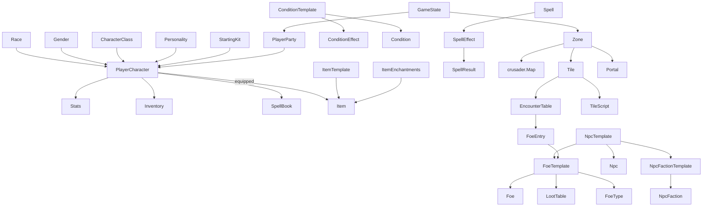

# Escape From The Maze - Game Data Model Data Dictionary

> Reference for the persisted domain model under `src/maze/mclachlan/maze/`.
> Companion: [architecture.md](architecture.md).

## 1. Conventions

- **Base type.** Most persisted authored objects extend
  [`DataObject`](../../src/maze/mclachlan/maze/data/v1/DataObject.java) and carry a
  `campaign` string (used for campaign-inheritance filtering). Runtime instances
  (`Item`, `Foe`, `Condition`, ...) are serialised inside save games.
- **Template vs instance.** Authored DB entities are usually templates keyed by
  `name`; runtime objects reference a template by name and add mutable state.

  | Template (DB) | Instance (runtime/save) |
  |---------------|-------------------------|
  | `ItemTemplate` | `Item` |
  | `FoeTemplate` | `Foe` |
  | `NpcTemplate` | `Npc` |
  | `ConditionTemplate` | `Condition` |
  | `NpcFactionTemplate` | `NpcFaction` |
  | `Spell` (definition) | entry in an actor `SpellBook` |
  | `Race` / `CharacterClass` / `Gender` | referenced by name on `PlayerCharacter` |
  | `LootTable` / `EncounterTable` | generate `Item`s / `Foe`s at runtime |

- **V2 JSON serialisation conventions** (see
  [`V2SerialiserFactory`](../../src/maze/mclachlan/maze/data/v2/serialisers/V2SerialiserFactory.java)):
  - Primitives and enums are stored **as strings** (`"turnNr": "4"`), not native JSON numbers.
  - `CurMax` serialises as `"current-maximum"` (e.g. `"4-4"`).
  - `CurMaxSub` serialises as `"current-maximum-sub"` (e.g. `"5-5-0"`).
  - `StatModifier` serialises as a compact hex-bitmap pair string
    (e.g. `"1c0000000002000000,01070707"`).
  - Cross-references are stored by name (`NameSerialiser`) and resolved via `Database`.
  - Polymorphic fields carry `"TYPE_KEY": "<fully.qualified.ClassName>"`.
  - Collection files are arrays of objects keyed by the `name` field; singletons
    (gamestate, a zone) are a single JSON object.

## 2. Entity Relationships



**Modifier resolution** for `UnifiedActor.getModifier(...)` layers, in order: base
`Stats` -> gender -> race -> class level abilities -> equipment -> party banner
items -> current combat action/intention -> conditions -> current tile + tile
conditions -> wielding combo -> encumbrance -> special abilities.

## 3. Stat / Modifier System

Files: [`Stats`](../../src/maze/mclachlan/maze/stat/Stats.java),
[`StatModifier`](../../src/maze/mclachlan/maze/stat/StatModifier.java),
[`CurMax`](../../src/maze/mclachlan/maze/stat/CurMax.java),
[`CurMaxSub`](../../src/maze/mclachlan/maze/stat/CurMaxSub.java).

- `Stats` bundles three resource pools (`hitPoints` as `CurMaxSub`, `actionPoints`
  and `magicPoints` as `CurMax`) plus a base `StatModifier` map.
- `Stats.Modifier` is a large enum (~170 keys) defined inside `Stats.java`. Each key
  has a `ModifierType` (category) and a `ModifierMetric` (display semantics).
- `StatModifier` is a sparse `Map<Stats.Modifier, Integer>`.
- `CurMaxSub.sub` is the fatigue/KO threshold: an actor is unconscious when
  `current <= sub`.

| `ModifierType` | Example keys |
|----------------|--------------|
| RESOURCE | `HIT_POINTS`, `ACTION_POINTS`, `MAGIC_POINTS` |
| ATTRIBUTE | `BRAWN`, `SKILL`, `THIEVING`, `SNEAKING`, `BRAINS`, `POWER` |
| COMBAT | `SWING`, `THRUST`, `CUT`, `LUNGE`, `BASH`, `PUNCH`, `KICK`, `THROW`, `SHOOT`, `FIRE`, `DUAL_WEAPONS`, `CHIVALRY`, `KENDO` |
| STEALTH | `STREETWISE`, `DUNGEONEER`, `WILDERNESS_LORE`, `SURVIVAL`, `BACKSTAB`, `SNIPE`, `LOCK_AND_TRAP`, `STEAL`, `MARTIAL_ARTS`, `SCOUTING` |
| MAGIC | `CHANT`, `RHYME`, `GESTURE`, `POSTURE`, `THOUGHT`, `HERBAL`, `ALCHEMIC`, `ARTIFACTS`, `MYTHOLOGY`, `CRAFT`, `POWER_CAST`, `ENGINEERING`, `MUSIC` |
| STATISTICS | `INITIATIVE`, `ATTACK`, `DEFENCE`, `DAMAGE`, resistances (`RESIST_*`), spell-casting levels (`*_MAGIC_SPELLS`), regen rates |
| PROPERTIES | `IMMUNE_TO_*`, `LIGHT_SLEEPER`, `BLIND_FIGHTING`, `FAVOURED_ENEMY_*` and many boolean/percentage flags |

| `ModifierMetric` | Meaning |
|------------------|---------|
| PLAIN | additive integer (e.g. +3 Brawn) |
| BOOLEAN | presence flag (value > 0) |
| PERCENTAGE | shown as a percentage (e.g. resistances, dodge) |

## 4. Entity Catalog

### 4.1 Actors & Characters

#### UnifiedActor - `stat/UnifiedActor.java`
Abstract base for all combat-capable actors (PCs, foes, NPCs).

| Field | Type | Meaning |
|-------|------|---------|
| `name` | String | Actor name |
| `levels` | Map<String,Integer> | Class name -> level |
| `race` | Race | Race reference |
| `gender` | Gender | Gender reference |
| `characterClass` | CharacterClass | Primary class |
| `stats` | Stats | Resource pools + modifiers |
| `inventory` | Inventory | Carried items |
| `spellBook` | SpellBook | Known spells |
| `stance`, `group`, `equipableSlots`, `bodyParts` | runtime | Combat/equipment state |

#### PlayerCharacter - `stat/PlayerCharacter.java`
Player-controlled party member; fully persisted in save games. Adds to `UnifiedActor`:

| Field | Type | Meaning |
|-------|------|---------|
| `experience` | int | XP total |
| `kills` / `deaths` / `karma` | int | Career stats |
| `portrait` | String | Portrait image id |
| `personality` | Personality | Speech personality |
| `spellPicks` | int | Pending spells to learn |
| `practice` | Practice | Per-skill practice progress |
| `activeModifiers` | StatModifier | Unlocked skill flags |
| `removedLevelAbilities` | List<String> | Suppressed level abilities |
| equipped items | Item | `primaryWeapon`, `secondaryWeapon`, `altPrimaryWeapon`, `altSecondaryWeapon`, `helm`, `torsoArmour`, `legArmour`, `gloves`, `boots`, `miscItem1/2`, `bannerItem` |

#### Foe - `stat/Foe.java`
Runtime enemy instance spawned from a `FoeTemplate` (extends `UnifiedActor`).

| Field | Type | Meaning |
|-------|------|---------|
| `template` | FoeTemplate | Source definition |
| `identificationState` | int | How identified the foe is |
| `isSummoned` | boolean | Summoned vs natural |
| `foeGroup` | FoeGroup | Combat group membership |
| `sprite` | EngineObject | Raycaster sprite handle |

#### FoeTemplate - `stat/FoeTemplate.java`
DB definition for an enemy type.

| Field | Type | Meaning |
|-------|------|---------|
| `name`, `pluralName`, `unidentifiedName`, `unidentifiedPluralName` | String | Display names |
| `types` | List<FoeType> | Taxonomy (favoured-enemy matching) |
| `race`, `characterClass` | ref | Race/class |
| `hitPointsRange`, `actionPointsRange`, `magicPointsRange`, `levelRange` | Dice | Rolled at spawn |
| `experience` | int | XP award |
| `stats` | StatModifier | Base modifiers |
| `bodyParts` | PercentageTable<BodyPart> | Hit locations |
| `playerBodyParts` | PercentageTable<String> | Where it strikes the party |
| `baseTexture`, `meleeAttackTexture`, ... | MazeTexture | Sprite textures |
| `loot` | LootTable | Drop table |
| `spellBook`, `naturalWeapons`, `spellLikeAbilities` | refs | Abilities |
| `stealthBehaviour`, `evasionBehaviour`, `fleeChance`, `focus`, `defaultAttitude`, `alliesOnCall` | AI | Behaviour |
| `faction` | String | Faction id |
| `npc` | boolean | Is an NPC |

#### Npc - `stat/npc/Npc.java`
Persistent NPC (extends `Foe`), saved per slot.

| Field | Type | Meaning |
|-------|------|---------|
| `template` | NpcTemplate | Source definition |
| `attitude` | NpcFaction.Attitude | Current disposition |
| `tradingInventory` | List<Item> | Stock for sale |
| `theftCounter` | int | Theft tracking |
| `zone` | String | Current zone |
| `tile` | Point | Current position |
| `found`, `dead`, `guildMaster` | boolean | State flags |

#### NpcTemplate - `stat/npc/NpcTemplate.java`
DB definition for an NPC: `displayName`, `foeName` (FoeTemplate ref), `faction`,
`attitude`, `script` (NpcScript), `alliesOnCall`, trading params (`buysAt`, `sellsAt`,
`maxPurchasePrice`, `willBuyItemTypes`, `inventoryTemplate`), interaction params
(`resistThreats`, `resistBribes`, `resistSteal`, `dialogue`, `speechColour`), map placement.

#### NpcFaction / NpcFactionTemplate - `stat/npc/`
`NpcFactionTemplate` (DB): `name`, `description`, default attitude, member lists.
`NpcFaction` (save): `template` ref + `attitude` (ATTACKING ... ALLIED).

### 4.2 Character Definition (DB templates)

#### Race - `stat/Race.java`
`name`, `description`, starting resource percentages
(`startingHitPointPercent`/`...ActionPoint.../...MagicPoint...`),
`startingModifiers`/`constantModifiers`/`bannerModifiers`/`attributeCeilings`
(StatModifier), body-part refs (`head`/`torso`/`leg`/`hand`/`foot` -> BodyPart),
`allowedGenders`, `magicDead` (boolean), `specialAbility` (Spell), `startingItems`
(List<StartingKit>), `naturalWeapons`, `suggestedNames` (gender -> names),
`unlockVariable`, `favouredEnemyModifier`, `characterCreationImage`.

#### CharacterClass - `stat/CharacterClass.java`
`name`, `description`, `focus` (COMBAT/STEALTH/MAGIC), starting resources,
`startingModifiers`/`unlockModifiers`/`startingActiveModifiers`,
`allowedGenders`/`allowedRaces`, `experienceTable` (ExperienceTable), level-up dice
(`levelUpHitPoints`, ...), `levelUpAssignableModifiers`, `levelUpModifiers`,
`progression` (LevelAbilityProgression).

#### Gender - `stat/Gender.java`
`name`, `startingModifiers`, `constantModifiers`, `bannerModifiers`.

#### BodyPart - `stat/BodyPart.java`
`name`, `displayName`, `modifiers`, `damagePrevention`, `damagePreventionChance`,
`nrWeaponHardpoints`, `equipableSlotType`.

#### StartingKit - `stat/StartingKit.java`
Character-creation equipment preset: `name`, `displayName`, `description`,
focus-specific modifiers, per-slot item name refs + `packItems`,
`usableByCharacterClass`.

#### Personality - `stat/Personality.java`
`name`, `description`, `colour` (Color), `speech` (Map<String,String> keyed by event).

#### Practice - `stat/Practice.java`
Save-game progress: `modifiers` (StatModifier of practice points per skill).

#### FoeType - `stat/FoeType.java`
Enemy taxonomy (extends `Race`) used for favoured-enemy bonuses.

### 4.3 Items

#### ItemTemplate - `stat/ItemTemplate.java`
DB item prototype (the largest db file). Key fields: `name`, `pluralName`,
`unidentifiedName`, `type` (int 0-27), `subtype`, `description`, `image`, `modifiers`,
`equipableSlots` (BitSet), `weight`, `usableByCharacterClass`/`Race`/`Gender`,
`questItem`, `curseStrength`, `maxItemsPerStack`, `baseCost`, `invokedSpell` +
`invokedSpellLevel`, `charges` (Dice) + `chargesType`, `identificationDifficulty`,
`rechargeDifficulty`, `equipRequirements`/`useRequirements`, `attackScript`,
weapon fields (`damage`, `attackTypes`, `toHit`, ranges, `ammo`/`ammoType`), armour
fields, `spellEffects`, `discipline`, `slaysFoeType`, `disassemblyLootTable`,
`conversionRate`.

#### Item - `stat/Item.java`
Runtime instance: `template` (name ref), `cursedState` (int 0/1/2),
`identificationState` (int 1/2), `stack` (CurMax), `charges` (CurMax),
`enchantmentName` (String) + runtime `enchantment` (ItemEnchantment).

#### ItemEnchantments / ItemEnchantment - `stat/`
`ItemEnchantments`: named scheme (`name` + list of `ItemEnchantment`).
`ItemEnchantment`: `name`, `prefix`/`suffix`, `modifiers`, weight/chance.

#### Inventory - `stat/Inventory.java`
Fixed-slot bag: `nrSlots` (int), `items` (List<Item>, null = empty slot).

### 4.4 Stats & Combat support

| Class | File | Purpose / key fields |
|-------|------|----------------------|
| Stats | `stat/Stats.java` | `modifiers` (StatModifier), `hitPoints` (CurMaxSub), `actionPoints`/`magicPoints` (CurMax) |
| StatModifier | `stat/StatModifier.java` | Sparse `Map<Stats.Modifier,Integer>` |
| CurMax | `stat/CurMax.java` | `current`, `maximum` |
| CurMaxSub | `stat/CurMaxSub.java` | adds `sub` (fatigue/KO threshold) |
| NaturalWeapon | `naturalweapons.json` | Innate attack (claw/bite): damage, attack types, modifiers |
| WieldingCombo | `wieldingcombos.json` | Dual-wield combo: primary/secondary template names + `modifiers` |
| AttackType | `attacktypes.json` | Named attack verb/type + modifiers |
| FoeGroup | `stat/FoeGroup.java` | Combat group of `Foe`s with formation |
| ExperienceTable | `stat/ExperienceTable.java` | Level <-> XP thresholds |
| LevelAbility / LevelAbilityProgression | `stat/LevelAbility*.java` | Class abilities granted per level |
| SpellLikeAbility | `stat/SpellLikeAbility.java` | A `Spell` + `ValueList` usable as an ability |
| CraftRecipe | `stat/CraftRecipe.java` | Item crafting definition |

### 4.5 Magic

| Class | File | Purpose / key fields |
|-------|------|----------------------|
| Spell | `stat/magic/Spell.java` | `name`, `displayName`, costs (`hitPointCost`/`actionPointCost`/`magicPointCost` as ValueList), `level`, `targetType`, `usabilityType`, `school`, `book`, `effects` (GroupOfPossibilities<SpellEffect>), `requirementsToCast`/`requirementsToLearn`, `castByPlayerScript`/`castByFoeScript`, `primaryModifier`/`secondaryModifier`, wild-magic fields, `projectile` |
| SpellEffect | `stat/magic/SpellEffect.java` | `name`, `displayName`, `type`, `subType`, `application`, `saveAdjustment` (ValueList), `unsavedResult`/`savedResult` (SpellResult) |
| SpellResult | `stat/magic/SpellResult.java` | Polymorphic outcome (Damage/Condition/Healing/Summon/...) via TYPE_KEY |
| SpellBook | `stat/magic/SpellBook.java` | Actor's known spells (list of Spell, saved by name) |
| PlayerSpellBook | `playerspellbooks.json` | Starting spell list per class |
| MagicSys | `stat/magic/MagicSys.java` | System constants/enums (SpellBook colours, school, target/effect types, magic colours, usability) |
| Value / ValueList | `stat/magic/Value.java` | Scaled numeric formula: `value`, `scaling`, `shouldNegate`, dice/modifier refs |

### 4.6 Conditions

| Class | File | Purpose / key fields |
|-------|------|----------------------|
| ConditionTemplate | `stat/condition/ConditionTemplate.java` | `name`, `displayName`, `icon`, `adjective`, `conditionEffect`, `duration`/`strength` (ValueList), per-turn damage ValueLists (HP/AP/MP/stamina), `statModifier`/`bannerModifier`, `scaleModifierWithStrength`, `strengthWanes`, `exitCondition`(+chance/effect), `repeatedSpellEffects`, optional `impl` |
| ConditionEffect | `stat/condition/ConditionEffect.java` | Behavioural type (KO/Fear/Sleep/...): `name`, effect class, `multiplesAllowed` |
| Condition | `stat/condition/Condition.java` | Runtime instance: `template` ref, `source` (actor name), `duration`, `strength`, `castingLevel`, damage ValueLists, `type`/`subtype`, `identified`/`strengthIdentified`, `createdTurn`, `hostile` |

### 4.7 World / Map

| Class | File | Purpose / key fields |
|-------|------|----------------------|
| Zone | `map/Zone.java` | `name`, `map` (crusader Map), `tiles` (Tile[][]), `portals` (List<Portal>), `script` (ZoneScript), rendering params (`shadeTargetColor`, `doShading`, `playerFieldOfView`, ...), `order`, `playerOrigin` |
| Tile | `map/Tile.java` | `scripts` (List<TileScript>), `statModifier`, `terrainType` (FAKE/URBAN/DUNGEON/WILDERNESS/WASTELAND), `terrainSubType`, `randomEncounterChance`, `randomEncounters` (EncounterTable), `restingDanger`/`restingEfficiency`; runtime `zone`/`coords`/`sector` |
| Portal | `map/Portal.java` | `mazeVariable`, `initialState`, `from`/`to` (Point), `fromFacing`/`toFacing`, `twoWay`, lock/trap (`canForce`, `canPick`, `difficulty[]`, `keyItem`, `consumeKeyItem`), `mazeScript`, `stateChangeScript` |
| EncounterTable | `map/EncounterTable.java` | `name`, `encounterTable` (PercentageTable<FoeEntry>) |
| FoeEntry | `map/FoeEntry.java` | Encounter composition: rows of foe template + count dice |
| LootTable | `map/LootTable.java` | `name`, `lootEntries` (GroupOfPossibilities<ILootEntry>) |
| LootEntry | `lootentries.json` | Single loot roll: item name + quantity dice |
| Trap | `map/Trap.java` | `name`, difficulty, spell effects, disarm params |
| TileScript | `map/TileScript.java` | Abstract tile event hook (`Encounter`, `Chest`, `Lever`, `FlavourText`, ... in `map/script/`) |
| ZoneScript | `map/ZoneScript.java` | Zone-level init/end-of-turn ambient script |
| MazeTexture | `data/MazeTexture.java` | Named image resource -> Crusader `Texture` (frames, animation, scroll, tint) |
| ColdString | `data/ColdString.java` | Lazy-loaded bulk text: `name` (global key), `body` (multiline prose). Stored in `strings/cold/<shard>.json`. |
| TextRepository | `data/TextRepository.java` | Per-campaign HotString + ColdStrings cache; API: `getHotString`, `getColdString` |

### 4.8 Game State

| Class | File | Purpose / key fields |
|-------|------|----------------------|
| GameState | `game/GameState.java` | `currentZone`, `difficultyLevel`, `playerPos` (Point), `facing`, `partyGold`, `partySupplies`, `partyNames`, `formation`, `turnNr` |
| MazeVariables | `game/MazeVariables.java` | `Map<String,String>` of quest/door/script flags |
| DifficultyLevel | `game/DifficultyLevel.java` | Difficulty preset; selects foe AI and spawn/combat modifiers |
| PlayerParty | `stat/PlayerParty.java` | Runtime party: PCs, gold, supplies, formation |
| PlayerTilesVisited | `game/PlayerTilesVisited.java` | Auto-map exploration per zone |
| Journal | `game/journal/Journal.java` | Quest/logbook/zone/npc entries |

## 5. DB File Map (`data/<campaign>/db/`)

File-to-entity mapping (from
[`V2Files`](../../src/maze/mclachlan/maze/data/v2/serialisers/V2Files.java)):

| JSON file | Entity |
|-----------|--------|
| `genders.json` | Gender |
| `races.json` | Race |
| `bodyparts.json` | BodyPart |
| `experiencetables.json` | ExperienceTable |
| `characterclasses.json` | CharacterClass (incl. LevelAbilityProgression) |
| `attacktypes.json` | AttackType |
| `conditioneffects.json` | ConditionEffect |
| `conditiontemplates.json` | ConditionTemplate |
| `spelleffects.json` | SpellEffect |
| `spells.json` | Spell |
| `playerspellbooks.json` | PlayerSpellBook |
| `lootentries.json` | LootEntry |
| `loottables.json` | LootTable |
| `textures.json` | MazeTexture |
| `objectanimations.json` | ObjectAnimations |
| `scripts.json` | MazeScript |
| `foetypes.json` | FoeType |
| `foetemplates.json` | FoeTemplate |
| `foespeech.json` | FoeSpeech |
| `foeentries.json` | FoeEntry |
| `encountertables.json` | EncounterTable |
| `traps.json` | Trap |
| `npcfactiontemplates.json` | NpcFactionTemplate |
| `npctemplates.json` | NpcTemplate |
| `wieldingcombos.json` | WieldingCombo |
| `itemtemplates.json` | ItemTemplate |
| `craftrecipes.json` | CraftRecipe |
| `itemenchantments.json` | ItemEnchantments |
| `naturalweapons.json` | NaturalWeapon |
| `personalities.json` | Personality |
| `startingkits.json` | StartingKit |
| `difficultylevels.json` | DifficultyLevel |
| `guild.json` | Map<String,PlayerCharacter> (reusable created characters) |
| `zones/<Name>.json` | Zone (one file per zone) |
| `strings/strings-*.json` | HotString bundles: `ui`, `event`, `gamesys`, `tips`, `campaign` (flat key→value JSON maps) |
| `strings/cold/manifest.json` | ColdStrings shard routing (prefix → shard name) |
| `strings/cold/<shard>.json` | ColdStrings shard: map of `ColdString` (`name`, `body`) for bulk lore/readables |

### Representative snippets

`itemtemplates.json` (polymorphic via TYPE_KEY, primitives as strings):
```json
{
  "TYPE_KEY": "mclachlan.maze.stat.ItemTemplate",
  "name": "Muckraker Boots",
  "type": "10",
  "modifiers": "1c0000000002000000,01070707",
  "equipableSlots": "0000001",
  "weight": "1000",
  "maxItemsPerStack": "1",
  "usableByCharacterClass": ["Ranger"],
  "chargesType": "CHARGES_INFINITE"
}
```

`foetemplates.json`:
```json
{
  "TYPE_KEY": "mclachlan.maze.stat.FoeTemplate",
  "name": "Mad Kami",
  "types": ["Outsider"],
  "hitPointsRange": "13d6+13",
  "levelRange": "1d2+12",
  "bodyParts": { "PERCENTAGES": [25,25,25,25], "ITEMS": ["DEFAULT_HEAD"] },
  "loot": { "NAME": "A_WEE_BIT_MORE_GOLD" },
  "spellBook": { "spells": [] }
}
```

`spells.json`:
```json
{
  "TYPE_KEY": "mclachlan.maze.stat.magic.Spell",
  "name": "Superman",
  "level": "4",
  "book": "White Magic",
  "school": "Transmutation",
  "targetType": "1",
  "effects": { "PERCENTAGES": [100], "POSSIBILITIES": ["superman spell"] },
  "requirementsToCast": [{ "colour": "4", "amount": "4" }],
  "primaryModifier": "CHANT",
  "magicPointCost": [{ "TYPE_KEY": "mclachlan.maze.stat.magic.Value", "value": "4", "scaling": "SCALE_WITH_CASTING_LEVEL" }]
}
```

`races.json`:
```json
{
  "name": "Human",
  "startingHitPointPercent": "80",
  "startingModifiers": "1ff,020202020102010301",
  "attributeCeilings": "1f8,0a0a0a0a0a0a",
  "head": "human head",
  "allowedGenders": ["Female", "Male"],
  "suggestedNames": { "Female": ["Shen"], "Male": ["Archibald"] }
}
```

`zones/<Name>.json` (embeds map, tiles, portals):
```json
{
  "name": "Gatehouse",
  "portals": [{
    "mazeVariable": "gatehouse.portal.dontcare",
    "initialState": "unlocked",
    "from": "9:27", "to": "9:26",
    "twoWay": "true", "keyItem": "null"
  }],
  "tiles": [],
  "map": {}
}
```

## 6. Save-Game File Map (`data/<campaign>/save/<slot>/`)

| File | Entity | Contents |
|------|--------|----------|
| `gamestate.json` | GameState | Zone, position, facing, party names, gold/supplies, formation, turn |
| `playercharacters.json` | List<PlayerCharacter> | Full PC state (identity, levels, XP, equipped items, inventory, spellbook, stats, practice, active modifiers) |
| `conditions.json` | Map<String,List<Condition>> | Active conditions keyed by bearer (`"<bearerType>~<bearerName>"`, e.g. `"1~Brunswick"`) |
| `npcfactions.json` | List<NpcFaction> | Faction attitudes |
| `npcs.json` | List<Npc> | Runtime NPC instances (position, attitude, stock, flags) |
| `mazevariables.json` | Map<String,String> | Quest counters, portal lock states, one-shot flags |
| `itemcaches.json` | Map<zone, Map<Point, List<Item>>> | Items left on the ground |
| `tilesvisited.json` | PlayerTilesVisited | Auto-map exploration |
| `journals/*.json` | Journal | `quest.json`, `logbook.json`, `zone.json`, `npc.json` |

### Representative snippets

`gamestate.json`:
```json
{
  "currentZone": "Gatehouse",
  "difficultyLevel": "Normal",
  "playerPos": "20:23",
  "partyGold": "0",
  "partySupplies": "100",
  "partyNames": ["Rowan", "Wa Na"],
  "formation": "3",
  "turnNr": "83"
}
```

`playercharacters.json` (Stats + an equipped Item):
```json
{
  "name": "Rowan",
  "race": "Dryad",
  "characterClass": "Shaman",
  "stats": {
    "modifiers": "3e00003400020005f8,03020207010501020201010606060606",
    "hitPoints": "5-5-0",
    "actionPoints": "0-0",
    "magicPoints": "4-4"
  },
  "primaryWeapon": {
    "template": "Fey Needle",
    "cursedState": "1",
    "identificationState": "2",
    "stack": "1-1"
  }
}
```

`conditions.json`:
```json
{
  "1~Brunswick": [{
    "template": "test spell effect",
    "duration": "99", "strength": "1",
    "type": "WATER", "hostile": "false"
  }]
}
```

`npcfactions.json`:
```json
[{ "template": "Gnolls", "attitude": "NEUTRAL" }]
```
